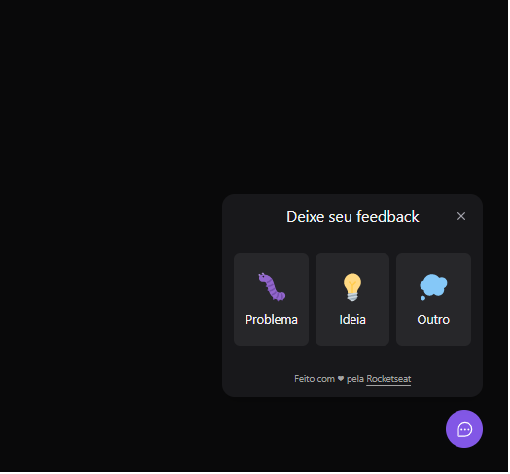

# Feedback Widget

Com apresentação do protótipo Feedback Widget no figma, desenvolvemos uma aplicação do zero.

	

## Tecnologias utilizadas
### Front-end
	- ReactJS

	- Typescript

	- Tailwindcss para estilização

	- Popover do headlessui para acessibilidade.
### Back-end
	- NodeJS

	- SQLite

	- Express

	- Prisma

	- serviço externo para o envio de e-mail com Mailtrap.
### Teste Unitários
	- Jest

	- SWC

## Links Úteis

https://tailwindcss.com/docs/installation

https://headlessui.dev/react/popover

https://mailtrap.io/

https://swc.rs/

